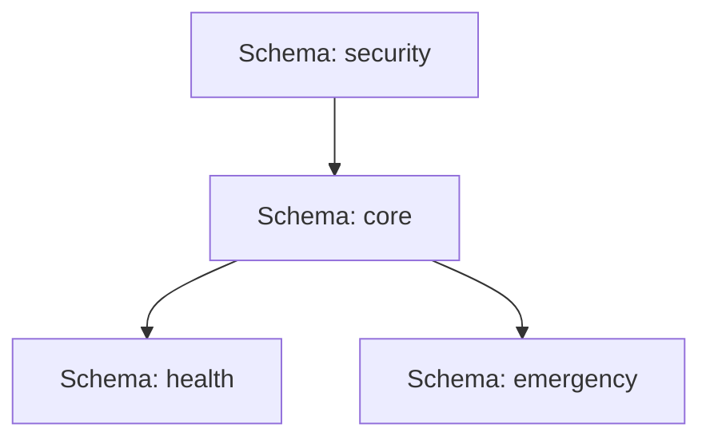

# RespondaCare — Developer & Integration Guide
This guide is designed for future developers and groupmates working on the **RespondaCare** platform. It outlines the codebase structure, database architecture, cryptographic security modules, and essential Supabase RLS conventions.

---

## 📁 Project Architecture & Directories
The application is built using **React 19 + TypeScript + Vite** for the frontend, and **Supabase (PostgreSQL)** for the backend.

```
RespondaCare/
├── src/
│   ├── components/       # Reusable UI components & layouts (TopBar, Sidebar, Button, Badge)
│   ├── lib/              # Client-side core logic (supabase.ts client, cryptoUtils.ts)
│   ├── pages/            # Page components grouped by role/persona:
│   │   ├── admin/        # Admin Settings, Resident Directory, Audit Logs
│   │   ├── patient/      # Resident Dashboard, Emergency SOS trigger, Profiles
│   │   └── responder/    # Responder Dispatch, Camera QR Scanning, Hospital Turnover (UIR)
│   ├── App.tsx           # React Router paths and access guards
│   └── main.tsx          # App mounting and global styles
├── seed.sql              # Core Database schema, triggers, and RPC procedures
├── supabase_auth_seed.sql # Supabase Auth table seeds for quick demo testing
└── DEVELOPER_GUIDE.md    # This guide
```

---

## 🗄️ Database Schema Design (4 Schemas)
To maintain strict data segregation and RBAC (Role-Based Access Control), the database is organized into **4 custom PostgreSQL schemas** within Supabase:



### 1. `security` Schema
Manages authentication, roles, audit trails, and access keys.
* **`security.users`**: Contains account profiles (name, email, role, barangay association). Links directly to Supabase Auth's `auth.users` via the `auth_uid` bridge.
* **`security.roles`**: Role configuration lookup (`admin = 1`, `bhw = 2`, `resident = 3`, `first_responder = 4`, `dispatcher = 5`).
* **`security.shift_keys`**: Rotating shift keys for field responder authorization.
* **`security.audit_log`**: System-wide logs capturing all reads, writes, and database operations.

### 2. `core` Schema
Stores general barangay and demographic information.
* **`core.barangays`**: Barangay directories (Pasay City).
* **`core.residents`**: Resident identities, consent flags, and encrypted health payloads.

### 3. `health` Schema
Stores sensitive clinical information protected under RA 10173.
* **`health.profiles`**: Hashed reference link to resident IDs with medical summary placeholders.
* **`health.records`**: Timeline logs of vitals and treatments.

### 4. `emergency` Schema
Stores real-time dispatch and clinical turnover records.
* **`emergency.incidents`**: Location, severity, status, and reporting logs of active SOS alerts.
* **`emergency.patient_care_reports`**: Unified incident/hospital turnover sheets (ABCD parameters, vital signs, GCS scores).

---

## 🔒 Supabase RLS (Row Level Security) & The Recursion Workaround
Because security checks on tables often require verifying the logged-in user's role (which involves querying `security.users`), standard RLS policies can cause **infinite recursion** (i.e. checking `users` triggers the `users` policy, which queries `users` again).

### The Solution: `SECURITY DEFINER` Helpers
We bypass RLS recursion by using a helper function that executes with system-level privileges (`SECURITY DEFINER`) to fetch the active user's role:

```sql
CREATE OR REPLACE FUNCTION security.current_user_role()
RETURNS INTEGER LANGUAGE plpgsql SECURITY DEFINER AS $$
DECLARE
  v_role_id INTEGER;
BEGIN
  -- 1. Try finding role using auth_uid
  SELECT role_id INTO v_role_id
  FROM security.users
  WHERE auth_uid = auth.uid()
  LIMIT 1;
  
  -- 2. Fallback: match session by verified email
  IF v_role_id IS NULL THEN
    SELECT role_id INTO v_role_id
    FROM security.users
    WHERE email = auth.email()
    LIMIT 1;
  END IF;

  RETURN COALESCE(v_role_id, 3); -- Defaults to Resident/Patient (3) if unknown
END;
$$;
```

### Implementing clean RLS Policies
When writing policies for tables, use the `security.current_user_role()` function to verify roles instantly without recursion:
```sql
-- Example: Only Admin (1) and BHW (2) can manage user accounts
CREATE POLICY users_admin_all ON security.users
  FOR ALL TO authenticated
  USING (security.current_user_role() IN (1, 2))
  WITH CHECK (security.current_user_role() IN (1, 2));
```

---

## 🔑 Rotating Shift Key Authentication Flow
First Responders must verify their identity using a daily rotating shift key before accessing dispatch channels:

```
[Responder Login] ➔ [Credentials Check] ➔ [MFA TOTP Token] ➔ [Daily Shift Key Challenge]
```

1. The shift key is rotated daily by the Admin via `SettingsPage.tsx` using a custom hashing algorithm.
2. The key is hashed inside the database using `crypt(key, gen_salt('bf'))`.
3. Validation is performed server-side through a secure RPC function `verify_shift_key`:
   ```sql
   CREATE OR REPLACE FUNCTION verify_shift_key(p_key TEXT)
   RETURNS BOOLEAN LANGUAGE plpgsql SECURITY DEFINER AS $$
   BEGIN
     RETURN EXISTS (
       SELECT 1 FROM security.shift_keys
       WHERE valid_date = CURRENT_DATE
       AND is_active = TRUE
       AND key_hash = crypt(p_key, key_hash)
     );
   END;
   $$;
   ```

---

## 🛡️ Client-Side Cryptography (RA 10173 Data Privacy Compliance)
To ensure compliance with the **Philippine Data Privacy Act (RA 10173)**, no raw/plaintext Protected Health Information (PHI) is ever transmitted to the database.

* **Encryption Algorithm**: **AES-256-GCM** using the native Web Crypto API (`window.crypto.subtle`).
* **Key Derivation**: Uses PBKDF2 with 100,000 iterations to derive keys from local/barangay credentials.
* **Format**: Packed string in Base64 format: `salt (16 bytes) + iv (12 bytes) + ciphertext`.
* **Flow**:
  1. During intake, the BHW inputs the medical profile.
  2. The browser encrypts this object client-side.
  3. The resulting base64 string is uploaded to `core.residents.encrypted_payload` and rendered as the QR Code.
  4. When the responder scans the QR code, the decryption happens **locally on the responder's device** using the built-in decryption key (`barangay45key`).

---

## 🧪 Database Testing, Seeding & SQL Verification Tutorial
To verify database rules, triggers, and functions directly inside the **Supabase SQL Editor**, developers can run these validation scripts:

### 1. Simulating and Testing RLS (Row Level Security)
Test if PostgreSQL blocks unauthorized table reads/writes based on active roles:

```sql
-- A. Verify Anonymous Users are blocked from reading patient records
SET local role anon;
SELECT * FROM core.residents; 
-- Expected result: 0 rows returned (blocked by RLS policy)

-- B. Verify Resident is locked to only see their own row
SET local role authenticated;
-- Set session variables to mock a specific resident user ID
SET local request.jwt.claim.sub = 'd1112222-3333-4444-5555-666677778888'; 
SELECT * FROM core.residents; 
-- Expected result: Only returns the row where user_id matches 'd1112222-3333-4444-5555-666677778888'

-- C. Verify Admin can see all rows
SET local role authenticated;
SET local request.jwt.claim.sub = 'a1112222-3333-4444-5555-666677778888'; -- Admin UUID
SELECT * FROM core.residents;
-- Expected result: Returns all resident rows (BHW/Admin privilege)
```

### 2. Testing Database Triggers (Audit Trail Check)
Test if the database automatically logs modifications made to resident files:

```sql
-- A. Perform an update action on a resident row
UPDATE core.residents 
SET address = 'Unit 4B, Pasay Tower' 
WHERE user_id = 'd1112222-3333-4444-5555-666677778888';

-- B. Query the immutable audit logs
SELECT * FROM security.audit_log 
ORDER BY created_at DESC 
LIMIT 1;
-- Expected result: A row showing 'UPDATE' action on table 'residents' with the modifier's credentials!
```

### 3. Testing Shift Key RPC Functions
Verify if the Blowfish hashing verification matches properly:

```sql
-- A. Check if a random key is marked invalid (Should return FALSE)
SELECT verify_shift_key('RESP-WRONG-KEY-9999');

-- B. Check if today's active shift key matches (Should return TRUE)
SELECT verify_shift_key('RESP-ABCD-1234-EFGH');
```

---

## 📝 Changelog / Work Done So Far (Project Handover Log)

### 1. Rotating Shift Key Authentication Gate
* **Admin Control**: Built a Daily Shift Key Management panel in the Admin Settings tab, enabling manual/auto key generation, hashing, and audit logging.
* **First Responder Login Gate**: Implemented a mandatory Step 3 validation step in the responder login sequence. The system challenges responders for the day's active shift key and calls the Supabase `verify_shift_key()` RPC for cryptographically secure checking.

### 2. Dynamic ID & QR Card Infrastructure
* **Overhauled Patient ID**: Replaced static, hardcoded placeholder IDs (like `RC-8829-X`) with dynamic, cryptographically clean strings derived from the Supabase primary key (`resident_id`). This applies across the Patient Dashboard, QR card UI, and the downloadable PDF card.
* **Unified Dashboard Loading**: Fixed a bug where active Supabase Auth sessions would conflict with custom local-storage authenticated mock accounts. The system now clears stale session tokens on login and dynamically maps the active username/payload.

### 3. Database RLS and Constraint Resolution
* **Resolved RLS Recursion**: Created the `security.current_user_role()` function using `SECURITY DEFINER` privileges. Replaced recursive checks in `security.users` RLS rules with this helper, allowing successful insert operations for Admin/BHW intakes.
* **Database Sync**: Created a script to match NULL `auth_uid` fields with their respective Supabase Auth identifiers.
* **Fixed Missing Constraints**: Resolved an issue in `AddResidentPage.tsx` where insertions failed due to a missing default value for the `password_hash` column. Added `password_hash: "password123"` to the frontend insert query and added a fallback `SET DEFAULT` constraint to the table.
* **Live Resident QR Dropdown**: Refactored `QRScanPage.tsx` to automatically pull live data from `core.residents` and `security.users` to populate the simulated scan dropdown, handling relationship joins defensively as arrays/objects.
